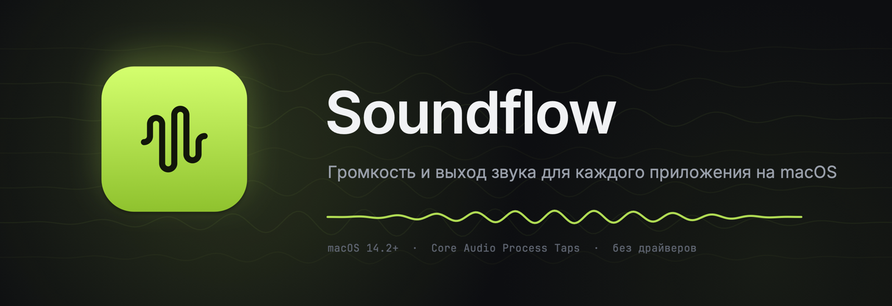
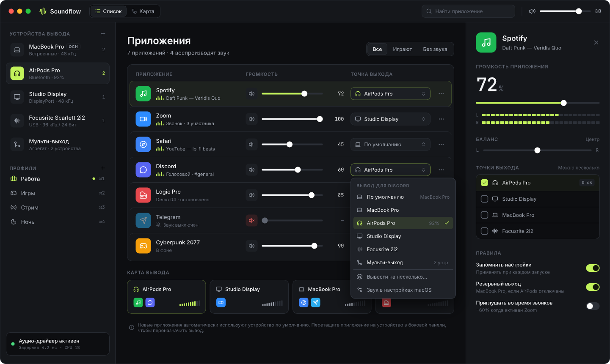
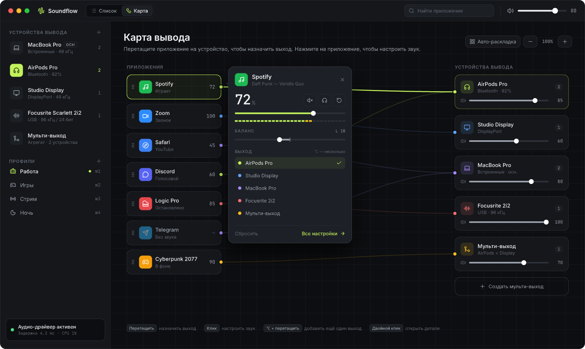
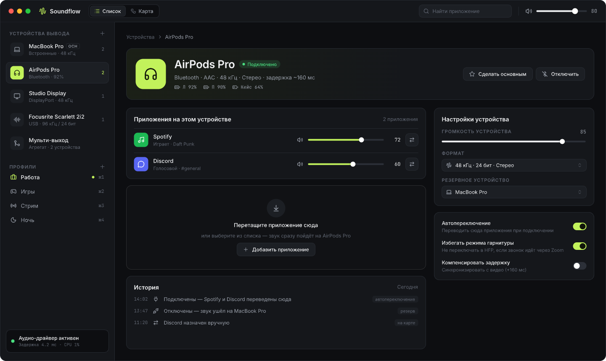
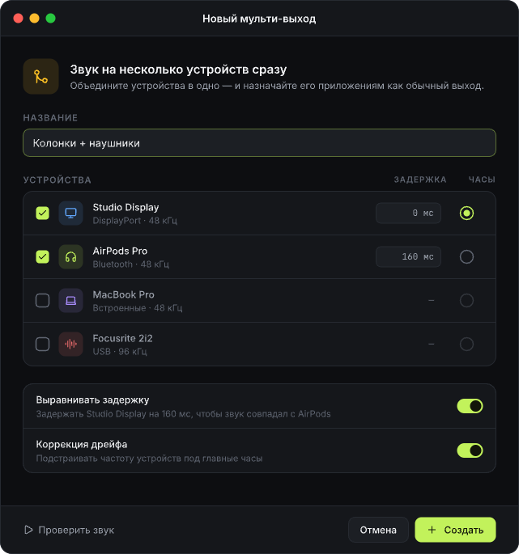
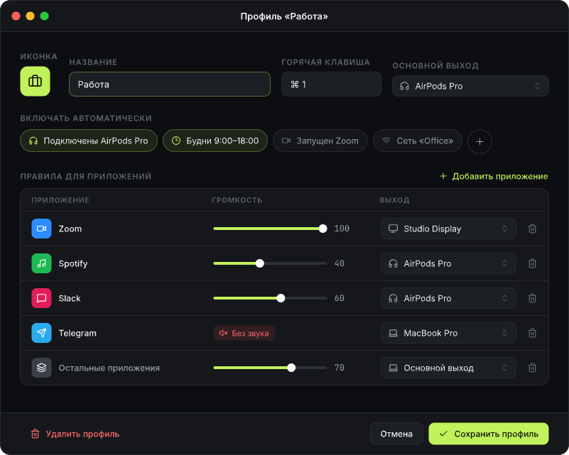
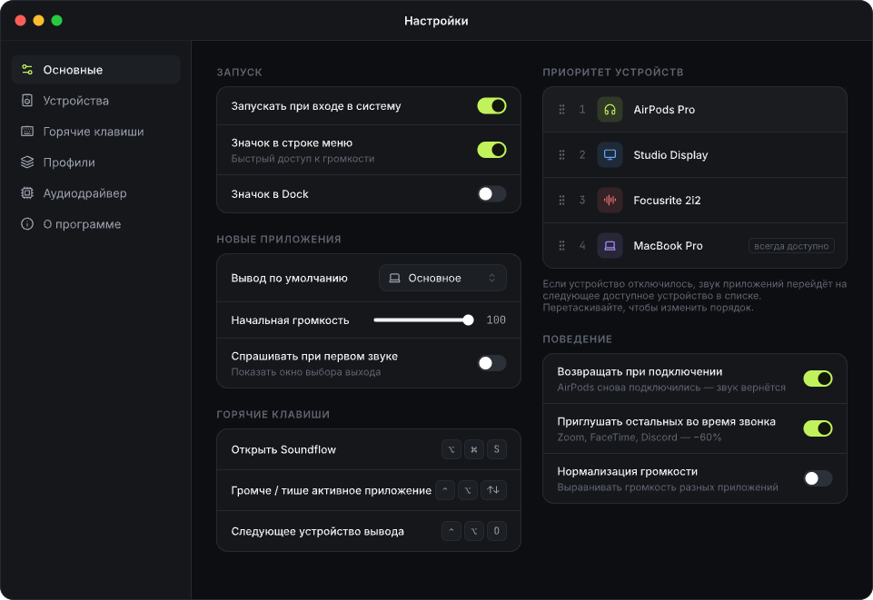
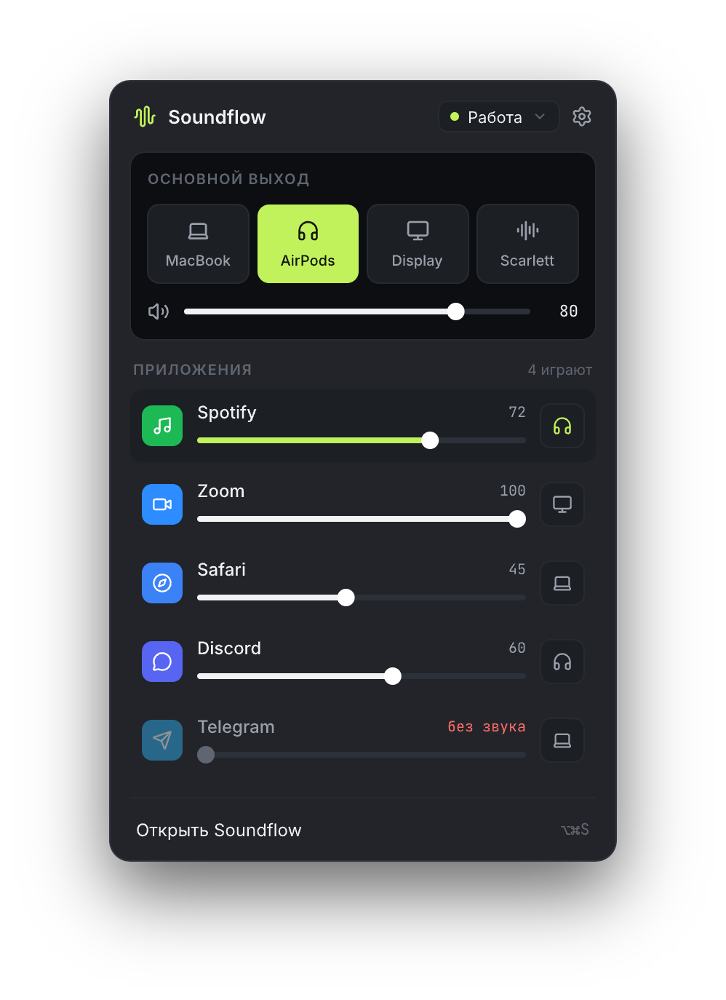
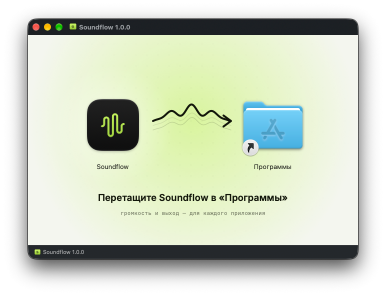

<p align="center">
  
</p>

<p align="center">
  <a href="https://github.com/Tolib-N8/sound-output-control/releases/latest"></a>
  
  
  
</p>

<p align="center">
  <b><a href="https://github.com/Tolib-N8/sound-output-control/releases/latest">⬇︎ Скачать Soundflow для macOS</a></b>
</p>

---

**Soundflow** — нативное приложение для macOS, которое даёт каждому приложению свою громкость и свой выход звука. Spotify — в наушники, Zoom — в колонки монитора, игра — сразу на два устройства, а Telegram — без звука. Без установки драйверов: всё работает на системном Core Audio.

<p align="center">
  
</p>

## Возможности

- 🎚 **Громкость для каждого приложения** — от 0 до 100%, баланс L/R, мгновенное «без звука» и индикатор уровня в реальном времени.
- 🎧 **Свой выход у каждого приложения** — назначайте любое устройство вывода, независимо от системного.
- 🔀 **Мульти-выход** — звук сразу на несколько устройств с выравниванием задержки (например, колонки + AirPods) и коррекцией дрейфа частоты.
- 🗺 **Карта вывода** — наглядный граф «приложения → устройства»: перетащите приложение на устройство, с <kbd>⌥</kbd> — добавить ещё один выход.
- 🛟 **Резервный выход** — отключились наушники? Звук приложений уходит на следующее устройство по приоритету и возвращается, когда они снова подключатся. Или ставится на паузу — как вы решите.
- 🗂 **Профили** — «Работа», «Игры», «Стрим», «Ночь»: наборы правил, которые включаются горячей клавишей или автоматически по расписанию, подключённому устройству, запущенному приложению или сети Wi‑Fi.
- 📞 **Приглушение во время звонков** — когда идёт звонок в Zoom, FaceTime или Discord, остальные приложения становятся тише.
- 🎛 **Управление устройствами** — громкость, частота дискретизации и разрядность, защита Bluetooth-наушников от режима гарнитуры (HFP).
- ⌨️ **Глобальные горячие клавиши** — громче/тише активное приложение, следующее устройство, выключить звук всем.
- 🟢 **Строка меню** — быстрый поповер с основным выходом и громкостью всех приложений.
- ✨ **Живой интерфейс** — анимация запуска, мягкие переходы между экранами и своя анимация у каждой иконки.

<table>
  <tr>
    <td width="50%"></td>
    <td width="50%"></td>
  </tr>
  <tr>
    <td align="center"><sub>Карта вывода: перетаскивание приложений на устройства</sub></td>
    <td align="center"><sub>Устройство: приложения на нём, история и настройки</sub></td>
  </tr>
  <tr>
    <td></td>
    <td></td>
  </tr>
  <tr>
    <td align="center"><sub>Мульти-выход с выравниванием задержки</sub></td>
    <td align="center"><sub>Профиль с автоматическими условиями</sub></td>
  </tr>
  <tr>
    <td></td>
    <td align="center"></td>
  </tr>
  <tr>
    <td align="center"><sub>Настройки: приоритет устройств и поведение</sub></td>
    <td align="center"><sub>Поповер в строке меню</sub></td>
  </tr>
</table>

## Установка

1. Скачайте `Soundflow-<версия>.dmg` со страницы [релизов](https://github.com/Tolib-N8/sound-output-control/releases/latest).
2. Откройте образ и перетащите **Soundflow** в «Программы».

<p align="center">
  
</p>

3. Запустите Soundflow и разрешите **«Запись системного звука»**, когда macOS спросит. Приложение не записывает и никуда не передаёт звук — оно только перенаправляет его на выбранные устройства.

> [!IMPORTANT]
> Сборка не нотаризована Apple, поэтому при первом запуске macOS может написать, что не может проверить разработчика. Откройте **Системные настройки → Конфиденциальность и безопасность** и нажмите **«Всё равно открыть»**. Или выполните в Терминале:
>
> ```sh
> xattr -dr com.apple.quarantine /Applications/Soundflow.app
> ```

**Требования:** macOS 14.2 Sonoma или новее, Apple Silicon или Intel.

## Как это работает

Soundflow использует **Core Audio Process Taps** (macOS 14.2+), поэтому никаких сторонних аудиодрайверов ставить не нужно.

- Приложения с настройками по умолчанию играют напрямую, как обычно, — без задержки и нагрузки.
- Когда вы меняете приложению громкость или выход, Soundflow перехватывает его звук (`CATapDescription`, оригинал глушится) и выводит через приватное агрегатное устройство из выбранных выходов.
- Обработку в реальном времени (громкость, баланс, нормализация, индикаторы) делает IOProc без аллокаций и блокировок.
- Входы Bluetooth-гарнитуры в агрегате отключены, поэтому наушники не переходят в низкокачественный режим HFP.

Настройки хранятся локально в `~/Library/Application Support/Soundflow/config.json`. Приложению не нужен интернет.

## Сборка из исходников

```sh
brew install xcodegen
git clone https://github.com/Tolib-N8/sound-output-control.git
cd sound-output-control
xcodegen generate
open Soundflow.xcodeproj           # или: xcodebuild -scheme Soundflow build
xcodebuild -scheme Soundflow test  # unit-тесты
```

Собрать DMG для релиза (универсальная сборка + оформленный установщик):

```sh
python3 -m pip install --user dmgbuild
./scripts/make_dmg.sh              # → dist/Soundflow-<версия>.dmg
```

<details>
<summary>Заметки для разработки</summary>

- Проект генерируется из `project.yml` (XcodeGen), `Soundflow.xcodeproj` не хранится в git.
- Если проект лежит в папке, синхронизируемой с iCloud (например, `~/Documents`), собирайте в стандартный DerivedData: такие папки добавляют файлам атрибуты, из-за которых падает `codesign`.
- Отладочная сборка подписана ad-hoc, поэтому после пересборки macOS может заново спросить разрешение «Запись системного звука».
- В DEBUG-сборке аргумент `-SFScreen map|app|device|multi|profile|menubar|toast|icons|tour|settings:<вкладка>|onboarding:<шаг>` сразу открывает нужный экран. `icons` — галерея всех иконок с раскадровкой анимаций, `tour` — демонстрация переходов между экранами.
- Иконки — [Lucide](https://lucide.dev), отрисовываются по частям. Контуры генерируются командой `scripts/gen_lucide_glyphs.py <lucide-static>/icons`.
- Дизайн всех экранов — `design/app.pen` (Pencil).

</details>

## Структура

```
Soundflow/
  Audio/      Core Audio: устройства, процессы, process taps, роутеры, движок
  Model/      правила, профили, мульти-выходы, горячие клавиши, хранилище конфигурации
  Services/   профили и триггеры, горячие клавиши, Bluetooth, уведомления, разрешения
  UI/         SwiftUI: главное окно, карта, строка меню, настройки, онбординг, анимации
SoundflowTests/  маршрутизация, триггеры, рендер, парсер SVG, анимации
scripts/         генерация иконок, оформление и сборка DMG
```

## Благодарности

- [Inter](https://rsms.me/inter/) и [JetBrains Mono](https://www.jetbrains.com/lp/mono/) — SIL Open Font License 1.1
- [Lucide](https://lucide.dev) — ISC License
